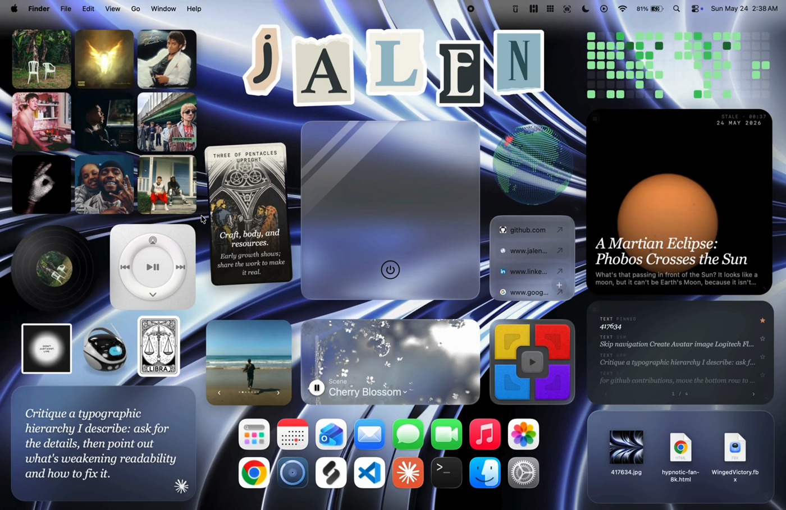

# animated-wallpaper

> A full-screen live WebGL shader wallpaper that animates behind your other widgets.

A self-contained widget for [Übersicht](http://tracesof.net/uebersicht/). The
entire widget lives in `index.jsx` (the shared design system is inlined), so it
runs on any Mac with no extra files beyond the bundled assets.

▶ [Watch the wallpaper demo](animated-wallpaper.mp4)

### On the desktop

The widget shown running alongside the full set:

## Install

1. Install and run [Übersicht](http://tracesof.net/uebersicht/).
2. Unzip `animated-wallpaper.widget.zip`, or copy the `animated-wallpaper.widget` folder into your
   Übersicht widgets directory:
   `~/Library/Application Support/Übersicht/widgets/`
3. Refresh Übersicht (menu bar icon -> Refresh All).

## Notes

- Self-contained; no network or external data.

## How to edit

Edit the SPEED and IMAGE constants at the top of index.jsx. For colors and motion, edit the shader inside swirl-8k.html (or append `?speed=` / `?img=` to the iframe URL).

All visual styling (colors, fonts, the card shell, drag/resize handles) is in
the inlined design-system block at the top of `index.jsx`.

## Bundled files

- `index.jsx`
- `swirl-8k.html`

## Other widgets

- [Clipboard History](https://github.com/jke48222/clipboard-history-widget)
- [Daily AI Prompt](https://github.com/jke48222/daily-ai-prompt-widget)
- [Daily Astronomy Photo](https://github.com/jke48222/daily-astronomy-photo-widget)
- [Daily Tarot](https://github.com/jke48222/daily-tarot-widget)
- [GitHub Contributions](https://github.com/jke48222/github-contributions-widget)
- [Now Playing](https://github.com/jke48222/now-playing-widget)
- [Recent Album Covers](https://github.com/jke48222/recent-album-covers-widget)
- [Recent Downloads](https://github.com/jke48222/recent-downloads-widget)
- [Rotating 3D Model](https://github.com/jke48222/rotating-3d-model-widget)
- [Spinning Globe](https://github.com/jke48222/spinning-globe-widget)
- [Wallpaper Switcher](https://github.com/jke48222/wallpaper-switcher-widget)

## Author

Jalen Edusei <jalen.edusei@gmail.com>
